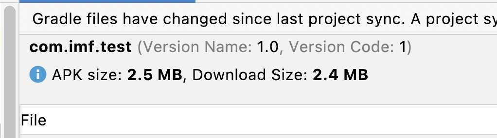

# Android-So-Handler

## 此仓库说明

此仓库在原有仓库基础上修复了一些问题，请查看 [Release](https://github.com/mcxinyu/Android-So-Handler/releases/)

### Jitpack 接入方式

[](https://jitpack.io/#mcxinyu/Android-So-Handler)

因为接入 Jitpack 后，暂时没有合并到主仓库，所以接入方式（maven 仓库链接）需要先按下面方法修改，其他的依旧按原仓库说明操作。

```groovy "根目录 gradle.properties"
buildscript {
    repositories {
        maven("https://jitpack.io")
    }
    dependencies {
        // ...
        if (userSoPlugin) {
            classpath("com.github.mcxinyu.Android-So-Handler:load-hook-plugin:${Versions.so_plugin_version}")
            classpath("com.github.mcxinyu.Android-So-Handler:file-plugin:${Versions.so_plugin_version}")
        }
    }
}
```

```groovy "app module gradle.properties"
repositories {
    maven("https://jitpack.io")
}
dependencies {
    implementation "com.github.mcxinyu.Android-So-Handler:load-hook:${Versions.so_plugin_version}"
    implementation "com.github.mcxinyu.Android-So-Handler:load-assets-7z:${Versions.so_plugin_version}"
}
```

---

## 以下是原仓库说明

** 减包工具集合 , 通过处理 so 库实现减包 **
> PS：减 so 文件时很有必要了解 so
>
来自那个三方或者一方库知己知彼，这里推荐我另一个项目 [AnalyzeSoPlugin](https://github.com/Android-Mainli/AnalyzeSoPlugin)
> 去溯源

## 特点如下:

1. 支持 APK 中所有通过 `System.Load/LoadLibrary` 加载的 So 库文件（包含 Maven、aar 等方式引入三方库与源码中的
   so 文件）进行处理。
2. 支持 7z 压缩与云端下发
3. 对项目代码侵入少，如果只是压缩 so
   库，只需一行初始化 `AssetsSoLoadBy7zFileManager.init(v.getContext());` 即可。
4. 云端下发 so 库需要在 `init` 中传入 `NeedDownloadSoistener`
   自行下载，并在下载后调用 `SoFileInfo#insertOrUpdateCache(saveLibsDir,File)` 插入缓存即可，**
   需要在加载前插入缓存 **

## 数据对比:

仅仅在加载时通过记录的 MD5 判断是否存在，不存在解压，存在则跳过直接加载。
这里通过压缩时记录的 MD5 判断是否需要解压更新不依赖 apk 版本减少解压次数。

|      so 库名称       |   apk 包中所占大小    | 7z 极限压缩大小 |    解压后实际大小     | 解压耗时 (毫秒) |
|:-----------------:|:---------------:|:---------:|:--------------:|:---------:|
|   RTCStatistics   |  1331kb(1.3M)   |   958kb   | 2752kb(2.68M)  |    109    |
| flutter(Debug 版本) | 10,547kb(10.3M) |  6360kb   | 23358kb(22.8M) |    700    |
| bd_idl_pass_token |      9.6k       |    8kb    |      17kb      |     3     |
|    idl_license    |     63.3kb      |   51kb    |     113kb      |     6     |
|      FaceSDK      |     269.5kb     |   220kb   |     450kb      |    25     |
|     turbonet      | 1,638.4kb(1.6M) |  1258kb   |     2737kb     |    167    |
|   gnustl_shared   |     273.7kb     |   195kb   |     693kb      |    28     |
|    xiaoyuhost     |     426.9kb     |   309kb   |   1009kb(1M)   |    48     |
|    crab_native    |     57.7kb      |   44kb    |     109kb      |     7     |

> **apk 包中所占大小:** apk 属于 zip 压缩 所以 apk 包中已经为 zip 压缩后大小
>
> **7z 极限压缩大小:** 7z 极限压缩大小是执行 7z a xxx.7z libxxx.so -t7z -mx=9 -m0=LZMA2 -ms=10m
> -mf=on -mhc=on -mmt=on -mhcf 压缩后大小
>
> ** 解压后实际大小:** 指 so 文件实际大小,AndroidStudio 中文件大小
>
> ** 解压耗时 (毫秒):** 统计手机为谷歌 **Pixel 2XL** 骁龙 **835** 处理器

# 接入方式如下:

ps: 配置较多全可走默认 ~_ ~!

0. 前往 [Release](https://github.com/Android-Mainli/Android-So-Handler/releases)
   下载对应版本 `maven.zip` 解压并放入项目根目录

1. 根 build.gradle 中加入

```groovy
buildscript {
    repositories {
        maven { url uri("${rootDir}/maven") }
    }
}
allprojects {
    repositories {
        maven { url uri("${rootDir}/maven") }
    }
}
```

2. 复制工程下 [so-file-config.gradle](so-file-config.gradle) 到工程根目录

3. 工程根目录 **gradle.properties** 中添加 `SO_PLUGIN_VERSION=x.x.x`
   **build.gradle** 中添加 `classpath "com.imf.so:load-hook-plugin:${SO_PLUGIN_VERSION}"`
   和 `classpath "com.imf.so:file-plugin:${SO_PLUGIN_VERSION}"`

   > x.x.x 修改为从 [Release](https://github.com/Android-Mainli/Android-So-Handler/releases) 下载的版本
   如：0.0.7

4. **app** 的 **build.gradle** 中添加 `apply from: "${rootDir}/so-file-config.gradle"`

5. 在 Application 中调用 `AssetsSoLoadBy7zFileManager.init(v.getContext());` 初始化, 重载方法支持传入
   NeedDownloadSoListener 完成云端所需要 so 库下载, 下载后使用 SoFileInfo#insertOrUpdateCache(
   saveLibsDir,File) 插入缓存中

6. 修改根目录中 [so-file-config.gradle](so-file-config.gradle) 进行压缩删减库配置主要修改
   deleteSoLibs 与 compressSo2AssetsLibs 如下:

```groovy
// 指定编辑阶段要删除的 so 库
deleteSoLibs = []
// 指定至 assets 中的 so 库
compressSo2AssetsLibs = []
```

** 其他配置请参考注释 **

## 插件介绍

## 一、 SoLoadHookPlugin 插件

1. 通过 Hook `System.loadLibrary` 与 `System.load` 实现加载转发具体步骤如下:

    * 通过 `ASM` 框架对 Hook 目标类进行字节码修改具体为 `System.loadLibrary` 与 `System.load`
      修改成 `SoLoadHook.loadLibrary` 与 `SoLoadHook.load`
    * `SoLoadHook` 可设置 `SoLoadProxy` 完成对外代理

   > `SoLoadHook` 有默认实现只是调用 `System.loadLibrary` 与 `System.load`

2. 具体接入步骤如下:

* gradle 配置

```groovy
//build.gradle 中只加入
classpath "com.imf.so:load-hook-plugin:${SO_PLUGIN_VERSION}"
//app.gradle 中只配置
apply plugin: 'SoLoadHookPlugin'
SoLoadHookConfig {
    // 是否跳过 R 文件与 BuildConfig
    isSkipRAndBuildConfig = true
    // 设置跳过的包名, 跳过的包不去 hook 修改后请先 clean
    excludePackage = ['com.imf.test.']
}
dependencies {
    implementation "com.imf.so:load-hook:${SO_PLUGIN_VERSION}"
}
```

* java 代码实现 `SoLoadProxy` 完成加载

```java
public interface SoLoadProxy {
    void loadLibrary(String libName);

    void load(String filename);
}
SoLoadHook.setSoLoadProxy(new XXXSoLoadProxy())
```

> 实现 SoLoadProxy 类后不会被修改 `System.loadLibrary` 与 `System.load` 字节码
> 如果不想在指定包名下修改 在 excludePackage 中配置报名
> 如果不想在指定类或方法下被修改字节码, 请添加注解 @KeepSystemLoadLib

## 二、~~SoFileTransformPlugin 与 SoFileAttachMergeTaskPlugin 插件依赖

SoLoadHookPlugin~~, 使用 ApkSoFileAdjustPlugin

~~SoFileTransformPlugin~~ 与 ~~SoFileAttachMergeTaskPlugin~~ 功能一样只是编辑阶段插入口不同
根据 com.android.tools.build:gradle:x.x.x 中版本号不同选择使用哪个
3.4.0 版本及以下使用 SoFileTransformPlugin
3.5.0 - 3.6.0 版本使用 SoFileAttachMergeTaskPlugin
4.1.0 以上包含 7.3.0 版本使用 ApkSoFileAdjustPlugin

> 4.1.0 中添加了 compressed_assets 机制导致无法把压缩后的 so 文件放入 asstes 中顾调整为针对已出包
> apk 进行 so 文件操作并重新签名

1. 通过实现 transform 或在 mergeNativeLibs 中添加 Action 的方式, 对 so 库进行 7z 压缩 (利用压缩差实现压缩
   apk), 压缩后放入 `asstes` 下的 `jniLib`
2. 根据压缩或删除 so 情况生成 `info.json`
3. 运行时进行解压加载 so

> 1. so 库依赖拷贝了 [ReLinker](https://github.com/KeepSafe/ReLinker) 中解析代码
> 2. 解压部分微调自 [AndroidUn7z](https://github.com/hzy3774/AndroidUn7zip)

** 接入方式参考顶部最开始部分 **

## 三、常见问题

1. 安装时报错 `Failure [INSTALL_FAILED_INVALID_APK: Failed to extract native libraries, res=-2]`

   请在 `application` 标签添加属性 `android:extractNativeLibs="true"` 如下：

   ```xml
   <?xml version="1.0" encoding="utf-8"?>
   <manifest ...>
       <application android:extractNativeLibs="true">
         ...
   </manifest>
   
   ```

   > 关于 extractNativeLibs 属性
   >
   > - 进行 apk 打包时，`android:extractNativeLibs=false` 会对 Module 中的 so 库进行压缩，最终得到的
       apk 体积较小。
       >
    - ` 好处是：` 用户在应用市场下载和升级时，因为消耗的流量较小，用户有更强的下载和升级意愿。
   > - ` 缺点是：` 因为 so 是压缩存储的，因此用户安装时，系统会将 so
       解压出来，重新存储一份。因此安装时间会变长，占用的用户磁盘存储空间反而会增大。
   > - `minSdkVersion < 23 或 Android Gradle plugin < 3.6.0`
       ，打包时默认值 `android:extractNativeLibs=true`；
   > - `minSdkVersion >= 23 并且 Android Gradle plugin >= 3.6.0`
       ，打包时默认值 `android:extractNativeLibs=false`；
   >
   > apk 对比 7z 是本插件压缩后版本 false/true 代表 extractNativeLibs 属性版本，可以下载 [apk](apk)
   拖入 Android Studio 查看如：
   >
   > | apk 路径                                        | apk 大小 | 下载大小 |
      > | ---------------------------------------------- | ------- | -------- |
   > | [app-debug-7z.apk](apk/app-debug-7z.apk)       | 2.5MB   | 2.4MB    |
   > | [app-debug-false.apk](apk/app-debug-false.apk) | 3.8MB   | 2.6MB    |
   > | [app-debug-true.apk](apk/app-debug-true.apk)   | 3.1MB   | 2.6MB    |

欢迎加我微信进行交流 x


